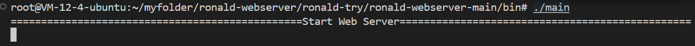
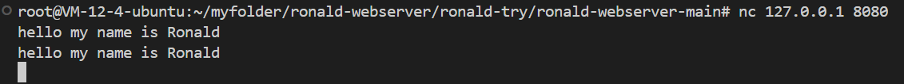
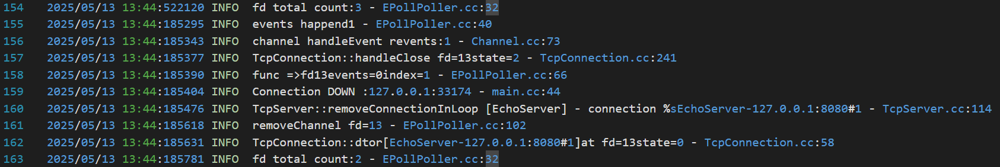

# ronald-webserver

Project Introduction

This project is a high-performance WEB server implemented in C++. The project's underlying architecture adopts the core design philosophy of the muduo library, featuring a multi-threaded multi-Reactor network model. Additionally, it incorporates a memory pool, an efficient double-buffered asynchronous logging system, and LFU caching.

## Development Environment

* linux kernel version5.15.0-113-generic (ubuntu 22.04.6)
* gcc (Ubuntu 11.4.0-1ubuntu1~22.04) 11.4.0
* cmake version 3.22

## Directory Structure

```shell
ronald-webserver/
├── img/ # Directory for images
├── include/ # Location for all header files (.h)
├── lib/ # Directory for shared libraries
|
├── log/ # Logging management module
│ ├── log.cc # Logging implementation
├── memory/ # Memory management module
│ ├── memory.cc # Memory management implementation
├── src/ # Source code directory
│ ├── main.cpp # Main program entry
│ ├── ... # Other source files 
|
├── CMakeLists.txt # CMake build file
├── LICENSE # License file
└── README.md # Project documentation
```

## Prerequisites

Install basic tools

```bash
sudo apt-get update
sudo apt-get install -y wget cmake build-essential unzip git
```

## Compilation Instructions

1. Clone the project:

```bash
   git clone https://github.com/Trapped-Bird/Ronald-webserver.git
   cd ronald-webserver
```

2. Create build directory and compile:

```bash
   mkdir build &&
   cd build &&
   cmake .. &&
   make -j ${nproc}
```

3. After building, enter the bin directory:

```bash
cd bin
```

4. Start the main executable:

```bash
./main 
```

**Note**: You need to open a new window and run `nc 127.0.0.1 8080` to start our client and connect to the web server started by the main executable.

## Running Results

By running the main executable in the bin directory, you will see the following results:

The log files will be stored in the `logs` directory under the bin directory. Each time the program runs, a new log file will be generated to record the program's running status and error information.

- Server running results as shown:



- Client running results as shown:



**Note**: The test results still use the echo server test, focusing on the implementation of the architecture.

---

### Simple Analysis of Log Core Content:

First, the log results are shown as:


1. File Descriptor Statistics

```bash
2025/05/13 13:44:522120 INFO  fd total count:3 - EPollPoller.cc:32
```

- Description: After a poll or event processing, print the number of monitored FDs in the current epoll - 3.
- Usually includes:
Listen socket (listen_fd)
One or more connection socket(client_fd)
Internal pipeline, wake-up fd (for example, for eventfd, timerfd, pipe, etc.)

2. Event Triggering

```bash
2025/05/13 13:44:185295 INFO  events happend1 - EPollPoller.cc:40
2025/05/13 13:44:185343 INFO  channel handleEvent revents:1 - Channel.cc:73
```

- An event occurred (events happend1), possibly a client socket close event.
- revents:1 indicates the triggered event type is EPOLLIN, meaning the peer closed the connection or sent data.

3. Connection Close Handling

```bash
2025/05/13 13:44:185377 INFO  TcpConnection::handleClose fd=13state=2 - TcpConnection.cc:241
2025/05/13 13:44:185390 INFO  func =>fd13events=0index=1 - EPollPoller.cc:66
2025/05/13 13:44:185404 INFO  Connection DOWN :127.0.0.1:33174 - main.cc:44
```

- TcpConnection::handleClose: Connection with file descriptor fd=13 closed, current state state=2 (possibly indicating "connected" state).
- Connection DOWN: Connection with client 127.0.0.1:33174 disconnected.
- events=0: Indicates this file descriptor is no longer listening for any events.

4. Removing Connection from Server

```bash
2025/05/13 13:44:185476 INFO  TcpServer::removeConnectionInLoop [EchoServer] - connection %sEchoServer-127.0.0.1:8080#1 - TcpServer.cc:114
2025/05/13 13:44:185618 INFO  removeChannel fd=13 - EPollPoller.cc:102
```

- TcpServer::removeConnectionInLoop: Server internally removes binding with connection 127.0.0.1:47376.
- removeChannel: Removed file descriptor fd=13 from EPoll's event listening list.

5. Resource Cleanup

```bash
2025/05/13 13:44:185631 INFO  TcpConnection::dtor[EchoServer-127.0.0.1:8080#1]at fd=13state=0 - TcpConnection.cc:58
```

- TcpConnection destructor (dtor) called, releasing connection-related resources.
- State state=0 indicates connection is completely closed, file descriptor fd=13 is destroyed.

## Functional Module Division

### Network Module

- **Event Polling and Distribution Module**: `EventLoop.*`, `Channel.*`, `Poller.*`, `EPollPoller.*` responsible for event polling detection and implementing event distribution processing. `EventLoop` polls `Poller`, and `Poller` is implemented by `EPollPoller`.
- **Thread and Event Binding Module**: `Thread.*`, `EventLoopThread.*`, `EventLoopThreadPool.*` bind threads with event loops, completing the `one loop per thread` model.
- **Network Connection Module**: `TcpServer.*`, `TcpConnection.*`, `Acceptor.*`, `Socket.*` implement `mainloop` response to network connections and distribute to various `subloop`s.
- **Buffer Module**: `Buffer.*` provides auto-expanding buffer to ensure ordered data arrival.

### Logging Module

- The logging module is responsible for recording important information during server operation, helping developers with debugging and performance analysis. Log files are stored in the `bin/logs/` directory.

### Memory Management

- The memory management module is responsible for dynamic memory allocation and deallocation, ensuring server stability and performance under high load conditions.

### LFU Cache Module

- Used to decide which content to delete to free up space when cache capacity is insufficient. The core idea of LFU is to prioritize removing the least frequently used cache items.
